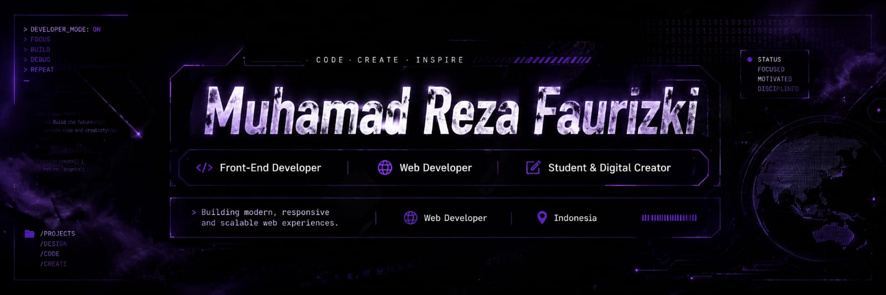

# Hi there 👋 I'm mozzki-f

🎓 Student | 💻 Aspiring Web Developer | 🎨 Digital Creator

Welcome to my GitHub profile!

I'm passionate about building websites, exploring technology, and creating digital projects that solve real problems. I enjoy learning new skills, turning ideas into reality, and continuously improving my craft.

## 🚀 Currently Working On
- Building modern and responsive websites
- Developing portfolio projects, landing page, company profile with HTML, CSS, JavaScript, PHP, PYTHON
- Exploring UI/UX design and creative web experiences

## 🌱 Currently Learning
- Front-End Development
- Web Interactivity
- Git & GitHub Collaboration
- AI Tools for Productivity and Creativity

## 🤝 Looking to Collaborate On
- Open-source beginner projects
- Web development projects
- Creative digital products

## 💬 Ask Me About
- HTML, CSS, JavaScript
- Website design ideas
- Beginner web development projects
- Digital creativity and AI tools

## 📫 How to Reach Me
- 
- 
- 

## ⚡ Fun Fact
I love turning simple ideas into interactive websites and digital experiences.

<h3 align="left">play games with me</h3>

###

<picture>
  <source media="(prefers-color-scheme: dark)" srcset="https://raw.githubusercontent.com/mozzki-f/mozzki-f/pacman-output/pacman-contribution-graph-dark.svg">
  <source media="(prefers-color-scheme: light)" srcset="https://raw.githubusercontent.com/mozzki-f/mozzki-f/pacman-output/pacman-contribution-graph.svg">
  
</picture>

###
